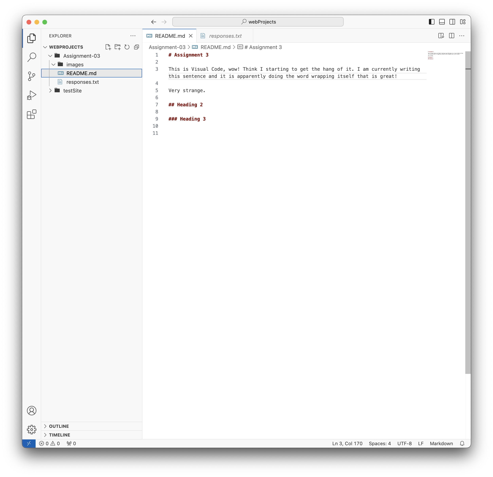

# Assignment 3

This is Visual Code, wow! Think I starting to get the hang of it. I am currently writing this sentence and it is apparently doing the word wrapping itself that is great!

Very strange. 

## Heading 2

### Heading 3

[My file](responses.txt)